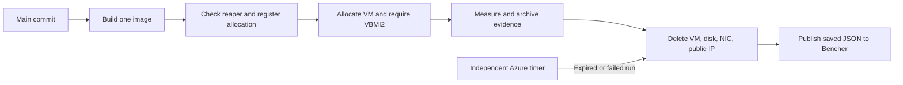

# Azure VBMI2 benchmarks

The Azure lane in the existing [benchmark workflow](../.github/workflows/benchmarks.yml)
automatically benchmarks each new first-parent `main` commit when
`AZURE_BENCHMARK_ENABLED=true`. A run builds **one source commit**, allocates a
`Standard_D2s_v6`, verifies native VBMI2 execution, measures the ten-case core suite,
saves evidence, and deletes its compute resources. The Bencher-hosted lane
continues independently.

The core suite uses automatic header-only dispatch in four executables. Scalar
and separately compiled variants remain in the image for local full-suite
diagnostics; every build comes from that same source commit. Historical
comparison happens in Bencher under the source SHA and the separate
`azure-d2s-v6-gcc15-v1` testbed. There is no new manually dispatched
workflow or paired-revision runner.

Status: live qualification of the current GCC 15.2.0 core profile passed,
including native VBMI2 checks, evidence validation, resource deletion, and
Bencher publication. An independent running-VM recovery drill also passed. Monthly cost
controls and alerts are deployed and verified; the GitHub enable variable is
`true`. The first automatic run authenticated through GitHub OIDC in cleanup;
full automatic execution remains to be verified after the image export correction.
The agreed operating budget is **USD 100 per calendar month for
all Azure benchmarking resources**. The subscription bills in GBP, so its Azure
budget is set to **GBP 60 per month**, with new allocations stopped at **GBP 48**
of reported spending. The remaining GBP 12 allows for delayed charges and
persistent resources.

The GCC 15.2.0 core qualification on 2026-09-23 used a D2s_v6 with an
`INTEL(R) XEON(R) PLATINUM 8573C`. All ten metrics completed at normal iteration
counts between 21:58:18 and 21:58:20 UTC, with five samples each. Encode and
decode selected VBMI2, and native correctness tests confirmed execution of both
kernels. Evidence validation passed, the boot ID remained unchanged, and all
four transient resources were deleted before publication. A separate Azure
inventory query confirmed only the fixed network and NSG remained in the compute
group. All ten published values were read back and verified in
[Bencher report 01a0d048-3b7a-7da2-a5e3-0b3452fb94de](https://api.bencher.dev/v0/projects/simdurl/reports/01a0d048-3b7a-7da2-a5e3-0b3452fb94de),
with no alerts, for source commit `c7510f5fdb65766c2f8b7ed95bedbcb6076f8e2d`
under `azure-d2s-v6-gcc15-v1`. The controller and guest came from harness commit
`8cee25be4f4834caeba8dc20a775ad57ada52a80`.

The earlier GCC 14.3.0 qualification on 2026-09-23 confirmed the Bicep control
deployment and a healthy independent reaper. A D2s_v6 guest reported
`INTEL(R) XEON(R) PLATINUM 8573C`
on x86-64. Between 21:11:38 and 21:14:06 UTC, all ten benchmark executables
completed, producing 1,356 series with five samples each. Encode and decode
selected VBMI2, native correctness tests recorded positive kernel execution,
and the guest boot ID remained unchanged. The controller confirmed deletion of
the VM, OS disk, NIC, and public IP and validated all raw samples and completion
hashes. The verified results were published in
[Bencher report 01a0d020-c1ec-79e0-8fdd-96aa18fc008f](https://api.bencher.dev/v0/projects/simdurl/reports/01a0d020-c1ec-79e0-8fdd-96aa18fc008f)
for source commit `e9b26eb106ae899c87406608c9efecceae4ad985` under the historical
`azure-d2s-v6-gcc14-v1` testbed. This remains evidence of the original full-suite
qualification; it is separate from the new GCC 15 core history.

The reaper deleted an orphaned disk registered under an expired run. A second
drill confirmed a running VM and all three companion resources, released the
controller's lease, and shortened the registered expiry to 21:18:17 UTC. The
independent timer swept the run at 21:20:02; read-only observations confirmed
all four resources absent by 21:20:19. No controller cleanup or fallback was
used, and the reaper reported no errors. Failed provisioning and guest-setup
failures also completed normal controller cleanup.

The controller, guest, exporter, and lifecycle checks passed 132 unit
tests; workflow lint and Bicep compilation also passed. Local GCC 15 container
checks passed the ten-metric core profile at normal iteration counts and a
1,356-metric full-suite smoke test. Local qualification used the
operator identity. GitHub OIDC authentication and artifact transfer have since
passed on `main`; automatic allocation, measurement, and publication remain to
be verified after the image export correction.



## Deployed infrastructure

The two resource groups separate transient compute from the services that recover
and audit it:

| Scope | Resources and purpose |
| --- | --- |
| `simdurl-benchmark-compute` | Fixed virtual network, benchmark subnet, and inbound-deny network security group. Each run adds a VM, OS disk, NIC, and outbound public IP, then deletes all four. No VM, disk, NIC, or public IP remains from qualification. |
| `simdurl-benchmark-control` | Artifact storage (`simdurlbench7550471d`), separate Function host/package storage (`simdfncbswidf3pwzmc`), the five-minute cleanup Function and Flex Consumption plan, its managed identity, Application Insights, Log Analytics, failure/heartbeat alerts, and the email action group. |
| Subscription | The monthly budget filtered to both groups, plus scoped role assignments for the controller application and cleanup identity. |

The workflow uses the supplied `SimdUrl` Entra application through the
`Benchmarking` environment and its existing OIDC federation. The unused
`simdurl-bench-controller` managed identity from initial qualification and its
role assignments have been removed.

Control resources persist between runs so cleanup can operate when GitHub is
unavailable. The two storage accounts separate controller-writable artifacts from
the cleanup Function's package and host state.

## Measurement and execution

The image pins GCC 15.2.0 and Python 3.14.7 by digest and uses the
[core measurement contract](benchmarking.md#measurement-contract): ten metric
series from four automatic-dispatch executables, with five samples per case at
normal iteration counts. The Azure controller accepts only this core profile.
The benchmark harness separately supports `--suite full` for local diagnostic
runs of 1,356 series across ten executables, including scalar and compiled builds.
The native VBMI2 correctness gate is unchanged by the smaller measurement set.

The pinned `docker/build-push-action` builds Azure images with `load: true` and
`provenance: false` so Docker exports exactly one executable image. Local builds
use the equivalent `--provenance=false`. Docker's default provenance adds a
separate attestation manifest when the builder uses the containerd image store;
the archive validator deliberately
requires a single image. PR tooling now validates the actual saved archive on the
hosted runner, and the Azure build repeats that validation before upload. Source
and harness SHAs, archive hashes, and image identities remain in the run evidence.
[Docker attestation behavior](https://docs.docker.com/build/metadata/attestations/).

`SIMDURL_BENCH_REQUIRE_VBMI2=1` requires both automatic encode and decode dispatch
to select VBMI2. The image then executes the native backend tests with
`--require=vbmi2`, with assertions enabled, and requires positive case and kernel
execution counts for both operations before timing starts. Validation and helper
operations may select other backends. Missing CPU support, skipped tests,
incorrect results, or incomplete measurements fail the run without publication.

Dsv6 is documented as Intel Emerald Rapids with AVX-512; D2s_v6 provides two
vCPUs and 8 GiB RAM. The native execution check verifies the instructions exposed
to this specific guest. No alternative SKU or region is selected automatically.
[Azure Dsv6 specifications](https://learn.microsoft.com/en-us/azure/virtual-machines/sizes/general-purpose/dsv6-series).

The GitHub build job has no Azure or Bencher credentials. It combines the selected
commit's `include/` and `src/` with the workflow revision's benchmark harness,
scripts, and native tests. The controller checks the archived image's hash and
proves the builder's Docker identity from its saved config/manifest descriptors.
After loading, it verifies the local store's image ID belongs to those same
identities. This accommodates classic Docker and containerd image stores while
retaining both IDs in build evidence. Compilation finishes before VM allocation.

The controller uses Azure Managed Run Command; the VM is not a GitHub runner.
Its public IP provides explicit outbound connectivity and the NSG blocks all
inbound connections, including SSH. The benchmark container has no network and
receives no cloud, GitHub, or Bencher credentials. Its native tests and timings
run on one recorded guest logical CPU. CPU affinity does not provide an exclusive
physical core. The guest records CPU features, topology, kernel, Docker version,
backend selection, and boot IDs. Host setup and image transfer finish before
timing begins.

The normal allocation lifetime is 60 minutes from registration, after the image
upload. The controller allows 15 minutes for ARM provisioning, a 20-minute remote
command with a 15-minute benchmark subprocess limit, and bounded cleanup. The
GitHub controller job has a 50-minute timeout; its separate cleanup job has 15
minutes. The Azure timer runs every five minutes and operates independently of
GitHub. These are recovery limits, not a guaranteed billing cutoff during a
service outage.

## One-time Azure setup

Use an administrator identity able to create resources, subscription budgets,
custom roles, and role assignments. Normal CI uses the configured Entra application through GitHub OIDC;
no Azure client secret is stored. The setup needs an Azure
subscription, a region with D2s_v6 capacity/quota and Functions Flex Consumption
support, a globally unique storage account name, and a budget alert email
destination. The same email can receive optional cleanup-error and missing-heartbeat alerts.

Install Azure CLI with Bicep support, Python 3.11 or newer, Docker, GitHub CLI,
and `jq` for these examples. Choose the values below; keep generated config and
setup outputs outside the checkout.

```sh
BENCH_SUBSCRIPTION="<subscription-id>"
BENCH_LOCATION="<region>"
BENCH_COMPUTE_GROUP="simdurl-benchmark-compute"
BENCH_CONTROL_GROUP="simdurl-benchmark-control"
BENCH_STORAGE="<unique-lowercase-storage-name>"
BENCH_REPOSITORY="<owner/repository>"
BENCH_CONTROLLER_CLIENT_ID="<existing-app-client-id>"
BENCH_ALERT_EMAIL="<budget-alert-email>"
BENCH_SETUP_DIR="$(mktemp -d)"
az login
az account set --subscription "$BENCH_SUBSCRIPTION"
BENCH_CONTROLLER_PRINCIPAL_ID="$(az ad sp show --id "$BENCH_CONTROLLER_CLIENT_ID" --query id --output tsv)"
az vm list-skus --location "$BENCH_LOCATION" --size Standard_D2s_v6 --all --output json
az vm list-usage --location "$BENCH_LOCATION" --output table
az functionapp list-flexconsumption-locations --output table
az vm image list --location "$BENCH_LOCATION" --publisher Canonical \
  --offer ubuntu-24_04-lts --sku server --all \
  --query "[?offer=='ubuntu-24_04-lts' && sku=='server'].{version:version,urn:urn}" --output table
```

Check SKU restrictions, regional vCPU quota, and the family quota before deployment.
Choose a concrete three-part Ubuntu image version from the final command; the
controller rejects `latest`. Azure CLI image-list filters also match prefixes;
the exact offer and SKU checks above exclude daily offers and ARM64 variants.
Verify the selected full URN exists in the chosen region and reports `x64` and
Hyper-V generation `V2` before putting its version into the configuration:

```sh
BENCH_IMAGE_VERSION="<selected-three-part-version>"
az vm image show --location "$BENCH_LOCATION" \
  --urn "Canonical:ubuntu-24_04-lts:server:$BENCH_IMAGE_VERSION" \
  --query '{urn:urn,architecture:architecture,hyperVGeneration:hyperVGeneration}' --output json
```

The guest installs Docker from Ubuntu packages and
records its actual version. Requalify relevant host/runtime changes before
combining their measurements with an existing history.

Use the existing GitHub environment **Benchmarking**, restrict its deployment
branch to `main`, and leave required reviewers and wait timers disabled so that
allocation and cleanup remain automatic. The OIDC subject must match GitHub's
actual subject format, including immutable repository IDs where configured:

```sh
gh api "repos/$BENCH_REPOSITORY/actions/oidc/customization/sub" \
  > "$BENCH_SETUP_DIR/oidc.json"
BENCH_SUBJECT_PREFIX="$(jq -er --arg repository "$BENCH_REPOSITORY" '
  if (.sub_claim_prefix // "") != "" then .sub_claim_prefix
  elif .use_default == true and .use_immutable_subject != true then "repo:" + $repository
  else error("Resolve the custom OIDC subject before deploying") end
' "$BENCH_SETUP_DIR/oidc.json")"
```

Use the returned `sub_claim_prefix` when present. With GitHub's legacy default
subject, the prefix is `repo:<owner/repository>`. If a custom subject template is
configured, reconcile it with the deployment's expected environment subject
before proceeding. The full federated subject is the selected prefix followed
by `:environment:Benchmarking`; do not assume repository names alone form it.

The existing application's federated credential must use issuer
`https://token.actions.githubusercontent.com`, audience `api://AzureADTokenExchange`,
and that full environment subject. Pass its application/client ID as
`externalControllerClientId` and its service principal's object ID as
`externalControllerPrincipalId`. The `az ad sp show` command above obtains the
service principal ID needed for Azure role assignments. The control deployment
grants this identity scoped runtime access and leaves its existing federated
credentials unchanged. Omit both external identity parameters to let the
template create a managed identity and its GitHub federation instead.

```sh
az group create --name "$BENCH_COMPUTE_GROUP" --location "$BENCH_LOCATION"
az group create --name "$BENCH_CONTROL_GROUP" --location "$BENCH_LOCATION"
az deployment group create --resource-group "$BENCH_COMPUTE_GROUP" \
  --name simdurl-network --template-file infra/azure/compute.bicep \
  --parameters location="$BENCH_LOCATION"
az deployment group create --resource-group "$BENCH_CONTROL_GROUP" \
  --name simdurl-control --template-file infra/azure/control.bicep \
  --parameters location="$BENCH_LOCATION" computeResourceGroup="$BENCH_COMPUTE_GROUP" \
    githubRepository="$BENCH_REPOSITORY" githubSubjectPrefix="$BENCH_SUBJECT_PREFIX" \
    githubEnvironment=Benchmarking externalControllerClientId="$BENCH_CONTROLLER_CLIENT_ID" \
    externalControllerPrincipalId="$BENCH_CONTROLLER_PRINCIPAL_ID" \
    storageAccountName="$BENCH_STORAGE" alertEmail="$BENCH_ALERT_EMAIL" \
  > "$BENCH_SETUP_DIR/control.json"
python3 infra/azure/package_reaper.py "$BENCH_SETUP_DIR/reaper.zip"
BENCH_FUNCTION="$(jq -r '.properties.outputs.functionName.value' "$BENCH_SETUP_DIR/control.json")"
az functionapp deployment source config-zip --resource-group "$BENCH_CONTROL_GROUP" \
  --name "$BENCH_FUNCTION" --src "$BENCH_SETUP_DIR/reaper.zip" --build-remote true
```

The compute template creates fixed networking. The control template creates
private blob containers, separate Function host storage, the independent reaper,
scoped runtime roles, and monitoring. It creates GitHub federation when it also
creates the controller identity. When `alertEmail` is
empty, no notification action group or health alert is created; the heartbeat
and allocation readiness checks still operate. Function Python
dependencies are installed by the remote build.
[Flex Consumption deployment](https://learn.microsoft.com/en-us/azure/azure-functions/flex-consumption-how-to).

For local qualification, the logged-in operator also needs compute management
permissions and **Storage Blob Data Contributor** on the control storage account.
An Azure management role alone does not grant blob data access. The template
already grants the controller's container-scoped access and account-scoped
user-delegation permission. Allow role assignments to propagate before testing.

Deploy the monthly budget at subscription scope. Its filter includes both the
compute and control groups so that VM, disk, public IP, storage, Function, and
monitoring charges are counted together. It sends email at 80% and 100% actual
spend and 100% forecasted spend, and grants the controller read access to this
specific budget:

```sh
az deployment sub create --location "$BENCH_LOCATION" --name simdurl-monthly-budget \
  --template-file infra/azure/budget.bicep \
  --parameters budgetName=simdurl-benchmark-monthly amount=60 \
    computeResourceGroup="$BENCH_COMPUTE_GROUP" controlResourceGroup="$BENCH_CONTROL_GROUP" \
    startDate="$(date -u +%Y-%m-01T00:00:00Z)" contactEmail="$BENCH_ALERT_EMAIL" \
    controllerPrincipalId="$(jq -r '.properties.outputs.controllerPrincipalId.value' "$BENCH_SETUP_DIR/control.json")"
az rest --method get \
  --url "https://management.azure.com/subscriptions/$BENCH_SUBSCRIPTION/providers/Microsoft.Consumption/budgets/simdurl-benchmark-monthly?api-version=2024-08-01" \
  --query '{amount:properties.amount,timeGrain:properties.timeGrain,currentSpend:properties.currentSpend,filter:properties.filter}'
```

Budgets inherit the subscription's billing currency. Verify that
`currentSpend.unit` is `GBP`, as confirmed for this deployment. The explicit
`amount=60` uses that currency; an Azure budget amount does not select dollars or
convert currencies. GBP 60 was approximately USD 79.66 using the ECB's
2026-09-23 reference rates, leaving additional margin below the USD 100 operating
ceiling. This GBP amount does not adjust automatically with exchange rates;
review it when rates or applicable taxes change.
[ECB reference rates](https://www.ecb.europa.eu/stats/shared/pdf/eurofxref.pdf).
Keep the recurring lane disabled if its currency cannot be verified. All
benchmark resources must remain in the two configured groups for their charges
to be covered by this filter.

Write a local JSON configuration, replacing every placeholder. `resource_group`
is the compute group; `control_resource_group` identifies the persistent resources
covered by the budget. `storage_account` is the evidence account from that control
deployment. `admin_public_key` contains the public key text, not a filename.
The VM requires this key to provision, although inbound SSH is blocked.

```json
{
  "subscription_id": "<subscription-id>",
  "resource_group": "simdurl-benchmark-compute",
  "control_resource_group": "simdurl-benchmark-control",
  "location": "<region>",
  "storage_account": "<storage-account-name>",
  "image_version": "<concrete-three-part-version>",
  "admin_public_key": "ssh-ed25519 <public-key-data>",
  "lifetime_minutes": 60,
  "budget": {
    "name": "simdurl-benchmark-monthly",
    "amount": 60,
    "currency": "GBP",
    "stop_at": 48,
    "resource_groups": [
      "simdurl-benchmark-compute",
      "simdurl-benchmark-control"
    ]
  }
}
```

Save it as `$BENCH_SETUP_DIR/azure-config.json`. The optional `lifetime_minutes`
defaults to 60 and accepts integers from 60 through 120. This configuration
contains no private key or bearer credentials.

The `budget` object is optional for other deployments, but is part of this
deployment's spending policy. It requires `control_resource_group`, and its group
list must match the configured compute and control groups. With it present, both `run` and `check` verify an
active monthly cost budget with the configured amount, currency, and exact
resource-group coverage. A missing or unreadable budget, invalid spend data, or
reported spending of GBP 48 or more rejects new allocation. `cleanup` continues
regardless of budget availability or spending.

Wait for the deployed timer's first successful invocation, then run the read-only
readiness check:

```sh
python3 scripts/benchmark_azure.py check --config "$BENCH_SETUP_DIR/azure-config.json"
```

The check requires `state/heartbeat.json` to report a healthy sweep within the
last 15 minutes. It also rejects earlier unfinished allocations with remaining
compute resources or active provisioning. It does not allocate a VM. Do not
write a fabricated heartbeat to bypass this check.

## Local qualification

Use local commands to test functionality before enabling CI. From a clean
checkout, first run the controller, exporter, and lifecycle tests:

```sh
python3 -m unittest discover -s scripts -p 'test_benchmark*.py'
python3 -m unittest discover -s infra/azure -p 'test_*.py'
```

Then build the same image and run a reduced workload for the checked-out commit:

```sh
BENCH_SOURCE_SHA="$(git rev-parse HEAD)"
BENCH_HARNESS_SHA="$BENCH_SOURCE_SHA"
BENCH_RUN_ID="simdurl-local-$(date -u +%Y%m%d%H%M%S)"
docker build --platform linux/amd64 --provenance=false --file benchmarks/bencher/Dockerfile \
  --build-arg "SOURCE_SHA=$BENCH_SOURCE_SHA" --tag simdurl-azure:local .
python3 scripts/benchmark_azure.py run --config "$BENCH_SETUP_DIR/azure-config.json" \
  --image simdurl-azure:local --commit "$BENCH_SOURCE_SHA" \
  --harness-sha "$BENCH_HARNESS_SHA" --run-id "$BENCH_RUN_ID" \
  --output-dir "$BENCH_SETUP_DIR/$BENCH_RUN_ID" --smoke
```

The output directory must be empty and the run ID must be unique. The command
uploads the built image, provisions the VM, requires native VBMI2 tests, gathers
results, and attempts cleanup even after failure. `--smoke` reduces iteration
counts; its results are functionality evidence and must not enter the normal
performance testbed. The CLI itself never publishes to Bencher.

Remove `--smoke` and use a fresh run ID/output directory to qualify the core
profile with its normal iteration counts.
Confirm complete measurements and deletion of the VM, disk, NIC, and public IP.
Also verify recovery after losing the controller with a running VM. A successful
benchmark alone does not validate independent cleanup. Further fault-injection
drills can cover interruption during provisioning and measurement, and missing
results. Keep the recurring CI lane disabled while running local qualification.
Controllers using the same control storage account acquire
a shared blob lease before checking readiness or allocating resources; a second
controller fails before allocation. The lease lasts 60 seconds and is renewed
every 20 seconds. A failed renewal stops the run for cleanup, and the next
controller still checks for leftover resources before allocating.

If local execution is interrupted or cleanup fails, use the same registered ID:

```sh
python3 scripts/benchmark_azure.py cleanup --config "$BENCH_SETUP_DIR/azure-config.json" \
  --run-id "$BENCH_RUN_ID"
```

## Enable automatic CI

After qualification, set these variables on the existing `Benchmarking` environment:

| Variable | Value |
| --- | --- |
| `AZURE_CLIENT_ID` | `controllerClientId` from the control deployment outputs |
| `AZURE_TENANT_ID` | `tenantId` from the control deployment outputs |
| `AZURE_SUBSCRIPTION_ID` | `subscriptionId` from the control deployment outputs |
| `AZURE_BENCHMARK_CONFIG` | Contents of the JSON configuration above |

For example:

```sh
gh variable set AZURE_CLIENT_ID --repo "$BENCH_REPOSITORY" --env Benchmarking \
  --body "$(jq -r '.properties.outputs.controllerClientId.value' "$BENCH_SETUP_DIR/control.json")"
gh variable set AZURE_TENANT_ID --repo "$BENCH_REPOSITORY" --env Benchmarking \
  --body "$(jq -r '.properties.outputs.tenantId.value' "$BENCH_SETUP_DIR/control.json")"
gh variable set AZURE_SUBSCRIPTION_ID --repo "$BENCH_REPOSITORY" --env Benchmarking \
  --body "$(jq -r '.properties.outputs.subscriptionId.value' "$BENCH_SETUP_DIR/control.json")"
gh variable set AZURE_BENCHMARK_CONFIG --repo "$BENCH_REPOSITORY" --env Benchmarking \
  --body "$(cat "$BENCH_SETUP_DIR/azure-config.json")"
gh variable set AZURE_BENCHMARK_ENABLED --repo "$BENCH_REPOSITORY" --body true
```

`AZURE_BENCHMARK_ENABLED` must be a **repository** variable because it controls
job selection before environment variables are available. It defaults to disabled
when absent. `BENCHER_SECRET` remains in the existing `Benchmarking` environment
alongside the Azure variables. Within the Azure lane, only the separate
publication step maps that secret to `BENCHER_API_KEY`; the controller and
cleanup jobs request OIDC permission without receiving the Bencher key. The
image-build job uses no GitHub environment and has no OIDC permission.

Each push uses the existing commit matrix, including intermediate first-parent
commits in a multi-commit push. Azure matrix jobs run sequentially and existing
main-branch workflow concurrency queues pushes. Pull requests only validate
tooling and containers. No manual launch is needed for the Azure lane. The
existing historical backfill facility remains available for recovering gaps.

Publication reads saved `results.json` with Bencher's file adapter and records
branch `main`, the exact source SHA, and testbed `azure-d2s-v6-gcc15-v1`. It runs
after cleanup. Rerunning only a failed publication job reuses the saved artifact
and does not allocate another VM. An ambiguous Bencher submission can already
have created a report; reconcile that report before retrying to avoid duplicates.
[Bencher file ingestion](https://bencher.dev/docs/explanation/bencher-run/).

## Evidence and cleanup

The controller writes `run.json`, `status.json`, and, on successful teardown,
`cleanup.json`. Downloaded guest files live under `guest/`: measurements,
`simdurl_evidence` with raw samples and native test records, host metadata,
completion hashes, and host logs. A top-level `results.json` is created only after
remote execution, evidence validation, and cleanup all succeed. Failed runs retain
whatever diagnostics could be retrieved.

GitHub keeps evidence and publication artifacts for 90 days; build-image artifacts
expire after seven days. Evidence artifact names remain stable across job retries.
Azure lifecycle rules expire input bundles after one day and result blobs after
90 days. Run manifests and cleanup state remain available for recovery.

Cleanup is invoked by the controller, a separate `always()` GitHub job, and the
independent five-minute Azure timer. The GitHub cleanup job checks all attempts
of its workflow run so that retrying cleanup still finds an earlier allocation.
It remains eligible when the enable variable is turned off during an active run.
Resource IDs are registered before provisioning. Cleanup validates their owner,
run ID, type, and compute group, then removes the VM and surviving disk, NIC,
and public IP; fixed networking and control infrastructure remain intact.

The reaper retries expired or failed allocations and maintains cleanup state to
catch resources that appear late after deployment cancellation. When configured,
its alert reports cleanup errors or a missing heartbeat. A failed cleanup blocks a later controller
from allocating more compute while earlier resources remain. The timer can run
without any active GitHub workflow.

Deletion failure triggers a deallocation attempt, with outstanding resources kept
for later cleanup. Deallocated VMs stop compute billing, but disks, storage, and
other retained resources can still incur charges. Guest shutdown and deleting an
ARM deployment record are not resource teardown.
[Azure billing states](https://learn.microsoft.com/en-us/azure/virtual-machines/states-billing).

The GBP 60 Azure budget covers both benchmark resource groups toward the USD 100
monthly operating ceiling. Azure's budget notifications report spending; the
controller's separate GBP 48 admission check stops new VM allocations. The GBP 12
headroom allows for charges not yet reported and for control resources that
persist between runs. These controls do not guarantee a final bill below GBP 60
or USD 100: cost data is delayed, an active run still needs cleanup, persistent
resources continue to run, and the GBP budget is not indexed to USD exchange rates.
Azure documents typical cost-data delays of 8–24 hours and daily budget
evaluation. [Azure budget behavior](https://learn.microsoft.com/en-us/azure/cost-management-billing/costs/tutorial-acm-create-budgets).

Review reported spending and alerts during operation. To stop new automatic
allocations immediately, set `AZURE_BENCHMARK_ENABLED=false`; let active cleanup
finish and keep the reaper running until every registered allocation is gone.
